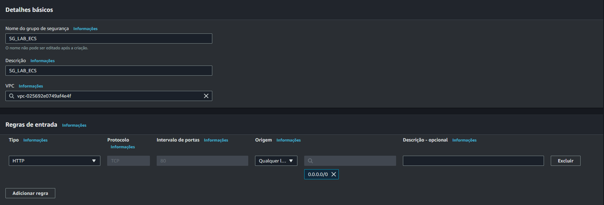
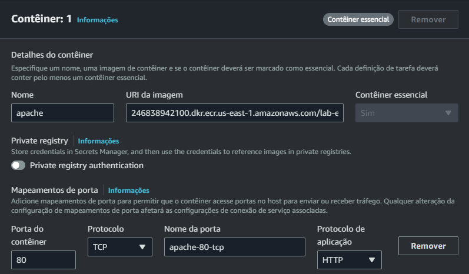

# CloudFaster Academy: Laboratório de containers na AWS (Amazon ECS + Amazon ECR)

> **Autor:** [CloudFaster Tecnologia](https://cloudfaster.com.br), **Última revisão:** 31/10/2022

## Introdução

Para utilização de containers Docker na AWS vamos ver o serviço Amazon ECS (Elastic Container Service), neste serviço podemos utilizar as imagens de Docker que geramos para executar nossos containers.

O Amazon ECS é baseado em Tarefas (`Tasks`) e Serviços (`Services`), onde:

- `Tasks` são utilizadas para configurar a forma que nosso container vai ser executado, como um ($ docker run), onde iremos mapear, portas, volumes e capacidade de memoria e processamento.

- `Services` são utilizados para definir como e quando a `Tasks` seram executada.

Juntamente com o serviço do Amazon ECS, precisamos utilziar o Amazon ECR (Elastic Container Registry) para armazenar as imagens Docker que faremos o upload.


## Pré-requisitos

1) Uma conta na AWS.
2) Um usuário com permissões suficientes para acessar os recursos necessários (ECS, ECR).
3) Credenciais de acesso programático
3) Docker instalado no dispositivo do aluno

> **Importante:** Segue a documentação oficial para a instalação do Docker em ambiente Lunix, MacOS e Windows.
https://docs.docker.com/get-docker/

4) AWS-CLI instalado e configurado no dispositivo do aluno

> **Importante:** Segue a documentação oficial da AWS para a instalação do AWS-CLI em ambiente Lunix, MacOS e Windows.
Link https://docs.aws.amazon.com/pt_br/cli/latest/userguide/getting-started-install.html

## Passo 1: Configurar um Dockerfile

Vamos criar um docker file com o objetivo de:
- Instalar o Apache.
- Fazer o download de um arquivo .html no diretório padrão do Apache.
- Iniciar o Apache quando o container for executado.

Acesse aqui o [Dockerfile](./scripts/Dockerfile) de exemplo.

## Passo 2: Fazer o build da imagem docker

No diretório/pasta que estiver o Dockerfile, execute o comando abaixo para fazer o build da imagem que vamos utilizar.

```sh
$ docker build -t lab-ecs:latest .
```

Pra verificar a imagem criada execute:

```sh
$ docker images
```

A imagem que fizemos o build deve aparecer.


## Passo 3: Criar um repositório no Amazon ECR

Após acessar sua conta AWS, navegue até o serviço "ECR" ou acesse diretamente por esse link:
https://console.aws.amazon.com/ecr.

Vamos criar um novo repositório de imagens docker.


Selecione a visibilidade do repositório como *Privado*

Coloque o nome `lab-ecr`


Deixe as outras opções como padrão (nao modifica-las), e clique em *Criar repositório*


Vamos observar que o nosso repositório foi criado com sucesso.


## Passo 4: Fazendo upload da imagem docker para o Amazon ECR e copiando a URI


Para realizar o upload da imagem docker no Amazon ECR vamos, clicar no nosso repositório:


Clicar na opção *Visualizar comando de push*.


Vamos ter duas formas de fazer o *push*:
- Utilizando sistema operacional *Linux ou Mac*.
- Utilizando sistema operacional *Windows*.

> **Importante:** É necessário ter configurado o AWS-CLI com suas credencias de acesso.
Segue link da documentação de configuração do AWS-CLI. (https://docs.aws.amazon.com/cli/latest/userguide/cli-configure-quickstart.html)

`LINUX/MAC:`


`WINDOWS:`


Após o upload da imagem docker vamos copiar a *URI da imagem* para usar ela na criação na nossa task posteriormente.


## Passo 5: Criando um novo grupo de segurança

Vamos realizar a criação de um grupo de segurança para os nossos containers.

Para isso, vamos acessar *em outra aba* o sevico do Amazon EC2 (https://console.aws.amazon.com/ec2).

Vamos clicar em *Security Group*, e em seguida em *Criar grupo de segurança*.


Nas configurações do *Grupo de segurança* vamos colocar:
- Nome: `sg-lab-ecs`
- Descrição : `sg-lab-ecs`
- Regras de entrada:
    - Vamos *Adicionar Regra*:
        - Colocar o protocolo *HTTP* e liberar para *qualquer origem*.

Após as configurações, clicar em `Criar grupo de segurança`.

Com isso o nosso *Grupo de segurança dos containers estão criados.




## Passo 6: Criando o cluster de ECS

Navegue até o serviço "ECR" ou acesse diretamente por esse link:
https://console.aws.amazon.com/ecr.


Vamos clicar em *Criar Cluster*


Na criação do Cluster vamos preencher o nome: `LAB-ECS`:


Deixaremos a VPC Padrão e as subnets com o sufixo `1a` e `1b`.


As demais opções vamos deixar default (não modificar) e clicar em *Criar*


Você vai ser redirecionado para o serviço do Amazon ECS e o cluster será provisionado.


Quando o Cluster estiver provisionádo, veremos a mensagem *Criado com êxito*, e o mesmo estará disponível.


## Passo 7: Criando uma Task Definition para o ECS

Agora que temos o Cluster disponível, vamos clicar em *Definições de tarefa*, e em *Criar nova definição de tarefa*,


Selecionar a opção *Criar nova definição de tarefa*.


Na tela de criação de task vamos escolher o nome: `task-lab-ecs`.


Na etapa de configuração de Container, colocamos:
- Nome: `apache`
- URI da imagem (que salvamos no passo 4)
- Porta que vamos utilizar: `80`
- Protocolo: `TCP`

Em seguida vamo Clicar em *Próximo*.



Na etapa de configuração de ambiente da aplicação, colocamos:
- Ambiente: `AWS Fargate`
- Sistema Operacional/Arquitetura: `Linux/X86_64`
- CPU: `1 vCPU` , Memória: `2GB`
- Função da tarefa: `TeamRole`
- Função de execução da tarefa: `TeamRole`

Em seguida vamo Clicar em *Próximo*.


Veremos o ambiente para uma revisão e em seguida clicar em *Criar*.


Podemos obsrvar que a *Task definition* está sendo provisionada.


Assim que concluir podemos ver.


## Passo 8: Rodando a Task de forma manual e validando o acesso

No painel do serviço do ECS, vamos abrir o *Cluster*, selecionar a aba *Taferas* e clicar em *Executar nova tarefa*.


Na configuração de ambiente vamos marcar a opção *Tipo de inicialização*.


Na configuração de implantação vamos colocar:
- Tipo: *Tarefa*
- Familia: *task-lab-ecs* na versão mais recente
- Numero de tarefas, vamos colocar *1*.


Nas configurações de *Rede*

Selecionamos as subnets: `us-east-1a` e `us-east-1b`.

> **Importante:** Caso esteja em outra região, utilize o prefixo da região e os finais `1a` e `1b`.


Vamos selecionar a opção de *Usar um grupo de segurança existente*.
- Nome do grupo de segurança: `sg_lab_ecs`


Agora vamos clicar em *Implantar*.


Podemos ver nossa Tarefa sendo provisionada.


Quando o status da nossa tafera estiver como *Em execução* vamos clicar nela.


Assim que clicar na *Task* em execução, vamos pegar o IP externo dela e realizar o teste no navegador.


Realizando o teste no navegador vamos ter acesso a aplicação dentro do container.


## Passo 9: Rodando task de forma automatica criando um serviço

Voltando a tela iniciar do nosso *Cluster de ECS*.
Vamos clicar em *Serviços* e em seguida em *Implantar*


Na tela de configuração do *Serviço* vamos selecionar:
- Opções de computação: `Tipo de inicialização`.
- Tipo de inicialização: `FARGATE`

Em Configura'ão de impantação vamos configurar:
- Tipo: `Serviço`
- Definição de tarefa:
    - DESMARQUE A OPÇÃO `Especifique a revisão manualmente`.
    - Familia: `task-lab-ecs` (que é *task* que criamos).
    - Revisão: `LATEST` (última versão).
    - Nome do serviço: `service-lab-ecs`.
    - Tipo de serviço: `Réplica`.
    - Taferas desejadas: `2`.

Nas configurações de rede, vamos fazer as mesmas do `Passo 08`.

Em seguida Clique em *Implantar*.

O provisionamento do nosso serviço vai iniciar, e deve demorar alguns minutos.


Quando finalizar, podemos ver nosso serviço ativo.


Clicando em *Task* já vemos elas sendo provisionadas.


E um pouco depois, com o status *Em execução*.
E finalmente podemos repitir o teste que fizemos no final do `Passo 08`, onde:
- Clicamos na *Task*, copiamos o endereço de IP Externo, e testamos no navegador.

.

Agora temos o mesmo ambiente do LAB de EC2, porem utilizando containers na AWS com o serviço do Amazon ECS.

That's all folks!


